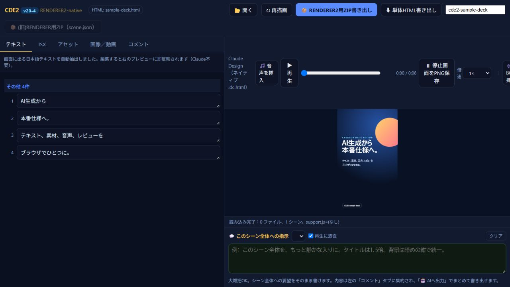

# CDE2 — Creator Deck Editor 2

> A browser-based last-mile editor for AI-generated motion-design decks.

[Japanese](#日本語) | [English](#english)

Companion MP4 renderer: [RENDERER2](https://github.com/phrase00-sketch/renderer2)



## 日本語

CDE2（Creator Deck Editor 2）は、AIが生成したモーションデザインのZIP（JSX＋assets）やHTMLを、実際の動画制作で使える形に仕上げるためのブラウザベースのローカルエディタです。

画面内テキストのライブ編集、画像・動画の差し替えとクロップ、ナレーション・BGMの挿入、HTML・PNG・MP4・制作パイプライン用ZIPへの書き出しまでを、専用バックエンドなしで行えます。

自分で直せない箇所には、シーン単位の自然言語コメントと参考画像・動画を添付し、編集指示・添付ファイル・デッキ本体をひとつのZIPにまとめてAIへ戻せます。

AI生成物と完成品の間にある「最後の1マイル」を、非エンジニアがAIと往復しながら自分の手で埋めるための道具です。

このプロジェクトは、GitHubが何かも知らなかった非エンジニアが、自分のYouTube制作の困りごとを解決するために始めました。前身のCDE1（Scene Editor）をv19まで改良し、その後CDE2をv20-4まで発展させています。「アプリを作って終わり」ではなく、毎日使い、問題を発見し、Codexと原因を調べ、修正し、実機で確認するサイクルを続けてきた記録でもあります。

### 主な機能

- AI生成のZIP（JSX + assets）、単体HTML、`.dc.html` の読み込み
- 画面内テキストの自動抽出とライブ編集
- 画像・動画スロットの差し替え、クロップ、動画イン点調整
- ナレーションとBGMの挿入、音量、フェード、倍速プレビュー
- シーンと画面上のコメントをAIへ渡せる形で出力
- 単体HTML、PNG、MP4、RENDERER2用ZIPの書き出し
- バックエンド不要。ファイルは原則としてブラウザ内で処理

### 使い方

1. `index.html` をダウンロードし、ChromeまたはEdgeで開きます。
2. 対応するZIPまたはHTMLをドラッグ＆ドロップします。
3. テキスト、素材、音声、コメントを調整します。
4. 単体HTMLまたは制作パイプライン用ZIPを書き出します。

動作を試すなら、生成画像2点を差し込み済みの [`examples/sample-deck.zip`](examples/sample-deck.zip) を読み込んでください。12秒・4シーンの縦型デッキで、テキスト編集、画像差し替え、シーク、書き出しを試せます。中身は [`examples/sample-deck.html`](examples/sample-deck.html) と [`examples/assets/`](examples/assets/) で確認できます。CDNからライブラリとフォントを読み込むため、初回表示にはネット接続が必要です。

CDE2の制作パイプライン用ZIP / HTMLを、PuppeteerとFFmpegで決定論的にMP4化する外部レンダラーは [RENDERER2](https://github.com/phrase00-sketch/renderer2) として別リポジトリで公開しています。

互換パッケージ固有の実行ファイル（例: `support.js` や `image-slot.js`）は、読み込むZIP側に含めてください。公開前の権利確認で出所を断定できなかった実行コードは、CDE2本体から意図的に除外しています。

AIにCDE2向けデッキを作らせる場合は、[デッキ制作ガイド](docs/DECK_AUTHORING_GUIDE.md#日本語)と[コピペ用AI依頼テンプレ](docs/AI_DECK_PROMPT.md#日本語)を利用できます。個人用の制作工程や特定の外部レンダラーに依存しない、公開版の互換仕様として整理しています。

### データとプライバシー

CDE2自体にファイルを受け取るサーバーはありません。ただし、CDE2のCDN依存関係、Google Fonts、または読み込んだデッキが指定する外部素材にブラウザがアクセスする場合があります。機密性の高い素材は、外部URLを含まないパッケージで利用してください。

## English

CDE2 (Creator Deck Editor 2) is a browser-based local editor that closes the gap between AI-generated motion-design packages—ZIPs containing JSX and assets, or HTML decks—and production-ready video.

Edit on-screen text live, replace and crop media, add narration and BGM, and export to HTML, PNG, MP4, or renderer-ready ZIP packages—all without a dedicated project backend.

For changes you cannot make directly, attach scene-level instructions and reference images or video, then export the brief, attachments, and edited deck together as a structured ZIP for an AI to continue from.

CDE2 helps non-engineer creators bridge the “last mile” between AI-generated design and finished work by working in dialogue with AI.

The project was created by a non-engineer who did not know what GitHub was, for a real daily YouTube production workflow. Its predecessor, CDE1 (Scene Editor), reached v19. CDE2 then evolved through v20-4. The version trail represents a repeated cycle of daily use, bug discovery, root-cause work with Codex, implementation, and real-browser verification—not a one-off generated demo.

### Highlights

- Import JSX + assets ZIPs, self-contained HTML, and compatible `.dc.html` decks
- Edit visible text with immediate preview updates
- Replace image/video slots, reframe assets, and adjust video in-points
- Add narration and BGM with volume, fade, seek, and playback-speed controls
- Capture scene comments and export a structured AI handoff
- Export standalone HTML, PNG, MP4, and RENDERER2-ready ZIP packages
- No project backend; processing happens primarily in the browser

### Quick start

1. Download `index.html` and open it in Chrome or Edge.
2. Drop in a supported ZIP or HTML deck.
3. Edit text, media, audio, and review comments.
4. Export a standalone HTML or renderer-ready package.

Import [`examples/sample-deck.zip`](examples/sample-deck.zip) for a four-scene, 12-second vertical demo with two generated images already assigned. It exercises text editing, media replacement, seeking, and export. The source is in [`examples/sample-deck.html`](examples/sample-deck.html), with media under [`examples/assets/`](examples/assets/). Internet access is required for CDN-hosted libraries and fonts.

The companion [RENDERER2](https://github.com/phrase00-sketch/renderer2) repository turns CDE2 renderer ZIP / HTML output into deterministic MP4 video with Puppeteer and FFmpeg.

Package-specific runtime files (for example, `support.js` or `image-slot.js`) must be supplied by the imported ZIP. Runtime code whose redistribution provenance could not be established was intentionally removed from this public release.

To generate a compatible deck with an AI, use the [deck authoring guide](docs/DECK_AUTHORING_GUIDE.md#english) and the [copy-ready AI prompt](docs/AI_DECK_PROMPT.md#english). They document the public compatibility contract without depending on a private production workflow or a specific external renderer.

## Project status

This is the first public release of a tool that has been actively used and maintained in a private production workflow. Public adoption metrics do not exist yet; issues, reproducible test cases, and format-compatibility reports are welcome.

The final CDE1 build is preserved in [`history/cde1-scene-editor-v19.html`](history/cde1-scene-editor-v19.html) as provenance for the product's evolution. It is historical code, not the supported release.

## Compatibility and trademarks

CDE2 can read package shapes produced by several AI-assisted design workflows, including Claude Design-style bundles. CDE2 is an independent community project and is not affiliated with or endorsed by Anthropic, OpenAI, or the maintainers of third-party tools mentioned in this repository.

## Development

Run the dependency-free smoke test:

```bash
python scripts/smoke_test.py
```

For browser testing, serve the repository instead of relying on `file://` behavior:

```bash
python -m http.server 8765
```

Then open `http://127.0.0.1:8765/`.

See [CONTRIBUTING.md](CONTRIBUTING.md), [SECURITY.md](SECURITY.md), [THIRD_PARTY.md](THIRD_PARTY.md), and [CHANGELOG.md](CHANGELOG.md).

## License

MIT. See [LICENSE](LICENSE).
